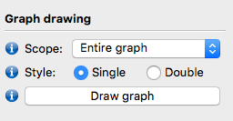
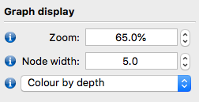

<style>
body {
text-align: justify}
</style>

```{r settings, include = FALSE}
switch <- FALSE
```

# Learning objectives {-}
1. Learn how to perform de novo genome assembly from reads
2. Understand the difference between contigs and scaffolds and complete assemblies
3. Learn how to look at the quality of the genome assembly
4. Understand the different measures used to assess genome assemblies


# Exercise 1 {-}
In this practical we will perform *de novo* assembly of a genome from Illumina reads.
You will be assembling a strain of *Staphyloccocus aureus*.

We will use SPAdes for this activity. SPAdes is one of a number of *de novo* assemblers that use short read sets as an input and the method for assembly is based on de Bruijn graphs. For information about SPAdes see this [link](http://cab.spbu.ru/software/spades/) and there is a [manual](http://cab.spbu.ru/files/release3.13.0/manual.html). 

In this activity, we will perform a *de novo* assembly of a short read set (from an Illumina sequencer) using the SPAdes assembler. The output from SPAdes that we are interested in is a multifasta file that contains the draft genome sequence.

Navigate to the directory for the assembly activity:

```/home/ubuntu/data/day-2/assembly-practical```

You will see a pair of FASTQ files for a *S. aureus* strain.

**Question 1:** Look at the fastq files. How long are the sequencing reads?

<textarea id="name" name="name" cols="100" rows="3" placeholder="You can input your answer here..."></textarea>

Now we will run `spades` to assemble the genome: 

```{bash, eval=FALSE}
spades.py -1 S_aureus_1.fastq.gz  -2 S_aureus_2.fastq.gz -o S_aureus --careful -t 4
```

We will run spades with the `--careful` setting which aims to minimise the number of errors.

**Question 2:** How many cores is this assembly using? How would you change this?

Spades will take around 6 or 7 minutes  to run. When spades has finished, look at the output files which are produced. 

<textarea id="name" name="name" cols="100" rows="3" placeholder="You can input your answer here..."></textarea>

**Question 3:** Can you tell which k-mers Spades used for the assembly?

<div class="toggle"><button>Hint</button>
Look insides `spades.log`: this is the log file with all the information about how spades ran.
</div><br>

<textarea id="name" name="name" cols="100" rows="3" placeholder="You can input your answer here..."></textarea>

Now look at the assembled contigs file, `contigs.fasta`. This is a fasta file containing multiple fasta entries, one for each assembled contig. As we know, the first line of a fasta entry starts with ">". The rest of the line tells us information about the contig - the name of the contig, the length of the assembled sequence, and the read coverage of the contig. 

Spades produces a file with contigs and a file with scaffolds. If Spades thinks that two contigs should be joined together, but does not know what the sequence between them should be or how long it is, it will join the two contigs together with a string of "NNNNNNN" for unknown sequence.

# Exercise 2 {-}
Now we will assess the quality of the contigs and scaffolds produced from Spades using a tool for assessing the quality of genome assemblies called Quast.

Run the following command:

```{bash, eval=FALSE}
quast -o quast -l spades-contigs,spades-scaffolds S_aureus/contigs.fasta  S_aureus/scaffolds.fasta
``` 

Quast gives output both as text files, and as a report.html file which you can open in a web browser. Use FileZilla to move the quast report to your computer. This is the report.html file in the directory assembly/quast.

Double-click on `report.html` to open it in your browser. The report has an interactive table and a graph. Hover over each line in the table for an explanation.

**Question 4:** How many contigs (over 500bp) are there in the two assemblies? What is the n50 value for the two assemblies?

Which assembly do you think is better?

<textarea id="name" name="name" cols="100" rows="3" placeholder="You can input your answer here..."></textarea>

# Exercise 3 {-}

We can also assess our assemblies by looking at the assembly graph. The assembly graph represents the assembly of the genome as a series of nodes and edges, showing regions which can be easily assembled and areas where there were multiple possibilities for assembly which have been resolved by the assembler. We will use a tool called Bandage for this. Bandage is a graphical tool so we will need to transfer the assembly graph files to the local computer and inspect them there.

Open the program Bandage. Go to `File...` menu > `Load Graph` and open the `assembly_graph.fastg` file which is already in the local directory. Once it is loaded push the "draw graph" button in the Graph Drawing menu. 



**Question 5:** How many completely separate assembly graphs have been drawn? Why could you have multiple disconnected graphs?

<textarea id="name" name="name" cols="100" rows="3" placeholder="You can input your answer here..."></textarea>

To investigate this further, colour in your graph according to the depth of coverage of each node. To do this, change `Random colours` to `Colour by depth` in the menu under `Graph Display`. The nodes are coloured from red to black, with higher coverage in red. 



**Question 6:** What do you notice about the colour of the short nodes and the long nodes in the chromosome graph? Why might this be?

<textarea id="name" name="name" cols="100" rows="3" placeholder="You can input your answer here..."></textarea>

**Question 7**: Look at the plasmid graph (the smaller graph at the bottom of the screen). What colour are the nodes in this graph? Why might this be?

<textarea id="name" name="name" cols="100" rows="3" placeholder="You can input your answer here..."></textarea>

# Optional exercise 4 {-}

In the `optional` directory, there are read sets and an assembly for two other organisms: *Klebsiella pneumoniae* and *Mycobacterium tuberculosis*.

Run `quast` on the two assemblies. Remember to change the `quast` output directory so you do not overwrite the results from Exercise 2.

<div class="toggle"><button>Hint</button>
Here is an example command line: `quast -o exercise4 optional/K_pneumoniae.fasta optional/M_tuberculosis.fasta`
</div><br>

<textarea id="name" name="name" cols="100" rows="3" placeholder="You can input your answer here..."></textarea>

**Question 8:** How many contigs are in the assemblies? How does this compare to our *S. aureus* assembly?

<textarea id="name" name="name" cols="100" rows="3" placeholder="You can input your answer here..."></textarea>

<script>
  $(".toggle").click(function() {
    $(this).toggleClass("open");
  });
</script>


