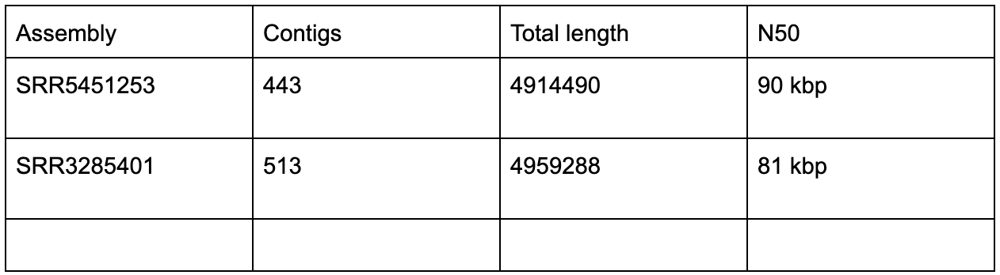

```{r settings, include = FALSE}
switch <- FALSE
```

# Learning objectives {-}
To become familiar with:  

1. The mechanics of running BLAST searches  

2. How to interpret BLAST results 

3. Ways in which homology can complicate the interpretation of BLAST results  

4. How BLAST, combined with the use of the extra information in graph genomes can aid in the localisation of AMR determinants to genomic elements

# Exercise 1 {-}

In this you will be given 6 assembled Salmonella genomes of unknown serotype and you need to tell us what serotype they are based on the results of BLAST analysis against a custom database, and cross checking the results with (a shortened version of) the Kauffman-White scheme.

1. In the terminal, navigate to the `OTN_bioinfx/Day3/AM/Salmonella_serotyping` directory, there should be 6 genome assemblies (fasta format) labelled `Salm_1` to `Salm_6` and a `salmonella_antigens.fasta` file. <br>
In order to run BLAST, we need a query and a database. In this case, the database is going to be the `salmonella_antigens.fasta` file, and the queries are going to be the 6 Salmonella assemblies. For simplicity, we will process them one at a time.

2.  First we need to process the FASTA which will be our database so that it is compatible with BLAST. For this we use the makeblastdb program. <br>

```{bash, eval = FALSE}
makeblastdb -dbtype nucl -in salmonella_antigens.fasta
```
  
How many sequences are there in the `salmonella_antigens.fasta` file? What are their names?  
<div class="toggle"><button>Hint</button>
Use `grep ‘>’ salmonella_antigens.fasta` to see all the sequence names in the file.
</div><br>

<div class="toggle-answer">

**Answer:** There are 10 sequences in the Salmonella antigens file. They are named with an identifier and the antigenic structure they encode.

</div>

> CAREFUL - make sure to include the quotation marks around the > in that command, or you will overwrite the contents of `salmonella_antigens.fasta`.  


3. Then, we can BLAST our query against the database we just made. Note that we use `blastn` here as we are comparing nucleotides.

3.1. Run

```{bash, eval = FALSE} 
blastn -help
```
Look at the `*** Formatting options` section. We are going to load our data into Excel.
Which do you think is the most suitable `-outfmt` option to use?

<div class="toggle-answer">

**Answer:** Outfmt 6 (tabular) is the best format

</div>

3.2. Run

```{bash, eval = FALSE} 
blastn -query Salm_1.fasta -db salmonella_antigens.fasta -outfmt XXX -out Salm_1_vs_salmonella_antigens.tsv
``` 

where XXX is the outfmt option you chose in question 3.1

3.3. Then, examine the output file using `head`

```{bash, eval = FALSE} 
head Salm_1_vs_salmonella_antigens.tsv
```

How many columns does the output have?

<div class="toggle-answer">

**Answer:** There are 12 columns in the output.

</div>

What is separating the columns? 
<div class="toggle"><button>Hint</button>
What does the T in tsv stand for?
</div><br>

<div class="toggle-answer">

**Answer:** The columns are separated by tabs.

</div>

3.4. What happens if you run the command without the `-outfmt` option, or with different `-outfmt` options? 

<div class="toggle"><button>Hint</button>
Look at the output file using `head` or `cat`.
</div><br>

<div class="toggle-answer">

**Answer:** The results are presented in a different format (which may be more familiar if you have used the NCBI BLAST website, but which is less convenient for analysing lots of different results.

</div>

3.5.  Make sure that each of your output files (e.g. `Salm_1_vs_salmonella_antigens.tsv`) is in the best format for viewing in Excel before proceeding.


3.6. What kind of `blast` would we do if we were comparing proteins against `Salm_1.fasta`? What kind of BLAST would we do if we were comparing `salmonella_antigens.fasta` against `Salm_1.fasta`?

<div class="toggle-answer">

**Answer:** proteins vs salm1 should be tblastn, salmonella antigens vs salm1 is still just blastn, the choice of query and database is somewhat arbitrary.

</div>

4. Now, we are going to look at the BLAST output using Excel. For this, the output files (e.g. `Salm_1_vs_salmonella_antigens.tsv`) need to be on your local computer rather than your CLIMB instance.

4.1. Use Filezilla to move the output files onto your local computer and open them one at a time using Excel.

4.2. You might notice that `blastn` does not include column names in the output, these are the column headings, paste them into row 1 in Excel. 

<div class="toggle"><button>Hint</button>
Use Paste Special -> transpose.
</div><br>

```{r table2, echo=FALSE, message=FALSE, warnings=FALSE, results='asis'}
tabl <- "

| Columns         | 
|-----------------|
| query_id        | 
| subject_id      |
| pct_identity    |
| aln_length      | 
| n_of_mismatches |
| gap_openings    |
| q_start         |
| q_end           |
| s_start         | 
| s_end           |
| e_value         |
| bit_score       |"

cat(tabl) # output the table in a format good for HTML/PDF/docx conversion
```


4.3. What do the different column headings mean? 

<div class="toggle"><button>Hint</button>
Use Google to find out. For example, [here](http://www.metagenomics.wiki/tools/blast/blastn-output-format-6) or [here](https://www.ncbi.nlm.nih.gov/books/NBK279690/)
</div><br>

<div class="toggle-answer">

**Answer:** Query sequence id, subject sequence id, percent identical bases, alignment length, number of mismatches, number of gap openings in the match, position in the query where the blast match starts, position in the query where the blast match ends, position in the subject where the blast match starts, position in the subject where the blast match ends, expect value, bit score.

</div>

4.4. How many BLAST hits are there for `Salm_1` vs `salmonella_antigens? 

<div class="toggle-answer">

**Answer:** There are 36 BLAST hits.

</div>

4.5. Look at the help for `blastn`, can you figure out some additional command line parameters you could enter which would reduce the number of results you have to look at? What are the potential downsides of applying these additional parameters?

<div class="toggle-answer">

**Answer:** You could filter by e-value `-evalue 1e-5` or `-evalue 0.00001`, but you might miss some interesting hits. You shouldn’t apply filters by default, always look at all the results generated and then filter.

</div>

4.6. Which is the best column to sort by so that you see the best hits first? Sort the data by this column?

<div class="toggle-answer">

**Answer:** The best column to filter by is bitscore as more discriminatory than e-value.

</div>

5. There are multiple different alleles of `fljB` and `fliC` in the database. Identify the best fljB and fliC hits for each genome, and then lookup those alleles in the Salmonella Serotypes excel file to identify the serotype of each genome. 

>Reminder: fliC is H1 and fljB is H2. Do this for all 6 genomes. 

<div class="toggle"><button>Hint</button>
One of the genomes might not have both H1 and H2.
</div><br>

<div class="toggle-answer">

**Answer:** See ‘salmonella serotypes - answers’ excel file.

</div>


6. Take the BLAST results for one of the genomes, e.g. Salm_6. Filter the BLAST results so that only hits where the subject was either the ‘best’ `fljB` or ‘best’ `fliC`. You should have `6` blast hits. Why are there 6 results? Hint1: Look at the query start and query end values for the `fljB` and `fliC` hits. 

<div class="toggle"><button>Hint</button>
There is an area of sequence similarity between `fljB` and `fliC`.
</div><br>

<div class="toggle-answer">

**Answer:** You see multiple hits because `fljB` hits against `fliC and vice versa because these two proteins have homologous areas.

</div>

7. What is another way you could tell which serotype the genomes are? The above method, looking at the genes which determine the serotype could be described as the ‘biologist’ way of serotyping from the genome, what might the ‘computer scientist/bioinformatician’ way be?

<div class="toggle-answer">

**Answer:**  You can just BLAST sections of the genome against the full NCBI nt/nr BLAST database. A section of around 50 kbp of e.g. Salm_1 will give a 100% hit against Mbandaka, and a 99% hit against some other serotypes.

</div>

# Exercise 2 {-}

In exercise 2, you will use BLAST within the Bandage genome graph visualiser to determine whether antibiotic resistance determinants are carried on plasmids or chromosomes.

1. What are the longest and shortest sequences in `genes_and_plasmids.fasta`?  

<div class="toggle"><button>Hint</button>
Use google to tell you how to do this. [this answer](https://www.biostars.org/p/118954/#119009) works well 
</div><br>

<div class="toggle-answer">

**Answer:**  Longest is pKST313 (300 kbp), shortest is FII-S1 (215 bp).

</div>

2. What are the differences between the sequences which have a name beginning with ‘p’ (i.e. lowercase p) and those which don’t?

<div class="toggle-answer">

**Answer:**  Sequences where the name starts with lowercase p are usually plasmids e.g. pSBLT or pKST313. 

</div>

3. Either using Google or your microbiology knowledge, which genes in the file are typically plasmid-borne and which are typically chromosomal? 

<div class="toggle"><button>Hint</button>
Use `grep ‘>’ genes_and_plasmids.fasta` or the output of bioawk from above, to find the names of the sequences in the file.
</div><br>

<div class="toggle-answer">

**Answer:**  

</div>
4. Download the 3 FASTG files and genes_and_plasmids.fasta from `Day3/AM/Salmonella_graph_genome_exercise` to your local computer

5. Examine the contents of of the genes_and_plasmids.fasta. Load the first sample into Bandage following the instructions from the [Bandage github page](https://github.com/rrwick/Bandage/wiki/Getting-started#load-a-graph)

5.1. What are the characteristics of this assembly?

<div class="toggle-answer">

**Answer:**  What are the number of nodes, the total length, N50, of each genome? (available in the top left of the main bandage window, for N50, need to click ‘more info’.

</div>



5.2. Do you think the assembly used an appropriate range of k-mer sizes? What other datasets do we need to get a better answer to this question? 

<div class="toggle"><button>Hint</button>
Look at [link](https://github.com/rrwick/Bandage/wiki/Effect-of-kmer-size)
</div><br>

<div class="toggle-answer">

**Answer:**  Is the graph still quite tangled, indicating that the max k-mer size was not long enough? Or were there too many dead ends, indicating that long k-mers were given more weight in the assembly than they should be. It’s hard to give a definite answer here, need to look at the assemblies of a variety of k-mers sizes to see. But just an exercise to try and get people thinking about the effect of k-mer size on assembly. SRR5451253 looks good. SRR3285401 and SRR5451282 look a bit more tangled. 

</div>


5.3. Can you see any sequences which look like they could be plasmids?

6. Prepare the FASTG file for BLAST analysis by following the instructions from [here](https://github.com/rrwick/Bandage/wiki/BLAST-searches)

<div class="toggle-answer">

**Answer:**  Yes in SRR5451253. No in SRR3285401. E.g. bottom left of the below. Maybe in SRR5451282, but not circular.

</div>

7. BLAST the `genes_and_plasmids.fasta` against the genome loaded into Bandage. You can reduce the view to include only blast hits by changing the 'scope' drop down in the 'graph drawing' section, select 'around blast hits', change the distance to e.g. 2 or 3, and click draw graph. The distance controls how many contigs will be included in the view. Setting distance to 3 means that all contigs which are within 2 or 3 'jumps' of a contig with a blast hit will be included. Experiment with this parameter to see what effect having it at e.g. 0 and 10 has.

8. Inspect the genome graph and the BLAST hits, explore the different options Bandage has for ‘scope’, zoom in and out, Node labels, Font etc. Answer the following the questions:
    
    8.1. Which plasmids are present in the sample? 
    
    8.2. Which AMR genes are present in the sample? 

<div class="toggle"><button>Hint</button>
It might be easier to view the BLAST results in the ‘Create/view BLAST search results’
</div><br>
<div class="toggle-answer">

**Answer:**  


</div> <br>

8.3. If a plasmid is present, what does the ‘depth’ node label (combined with the graph structure) tell you about repeat sections in the plasmid?

9. In the assembly SRR5451253, what is interesting about the CTX-M15 encoding gene? 

<div class="toggle"><button>Hint</button>
blast every contig linked to the contig which encodes ctx-M15, you can do this by copying the node sequence or by using BLAST directly through Bandage via the Output tab. 
</div><br>

<div class="toggle-answer">

**Answer:**  Looks like there are two copies of ctx-M15, one on the plasmid and one on the chromosome. OmpD is included because the integron carrying ctx-M15 is inserted into the middle of OmpD . 

</div>

Bonus question: why do you think OmpD is included in the genes_and_plasmids.fasta?
 
<script>
  $(".toggle").click(function() {
    $(this).toggleClass("open");
  });
</script>