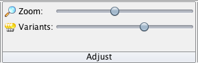

<style>
body {
text-align: justify}
</style>

```{r settings, include = FALSE}
switch <- FALSE
```

# Learning objectives {-}

1. Understand alignment of reads to a reference genome
2. Understand SNP and indel calling from an alignment
3. Understand how to visualise alignments and SNP calls


In this practical we will be looking at variant calling by taking reads from a strain of interest and aligning them to a reference genome to identify differences between our strain and the reference. The tool we will use to perform alignment and SNP calling is called Snippy. This provides a straightforward way to run multiple alignment and variant calling programs with a single command line.

# Exercise 1 {-}

Navigate to the directory with the variant calling example:

`/home/ubuntu/data/day-4/variant-calling-practical`

In here you will find part of a *Staphyloccocus aureus* reference genome, and the paired-end reads from an Illumina run of a different *Staphylococcus aureus* strain. We will use the tool `Snippy` to look for SNP, indels and rearrangements between the reference strain and our mutant strain.

Run the following Snippy command line:

```{bash, eval=FALSE}
snippy --outdir varcall --ref wildtype.fna -R1 mutant_R1.fastq -R2 mutant_R2.fastq --ram 2 --force
```

This should take only a few seconds. The output files will all be in the `varcall` directory. Navigate to this directory and look at the Snippy output files.

**Question 1:** Which file extensions do you recognise? Do you know what type of data will be in each file? Write down any you recognise below.

<textarea id="name" name="name" cols="100" rows="3" placeholder="You can input your answer here..."></textarea>

The `snps.bam` file contains the alignments of the reads in the `fastq` files against the reference genome. We will use a tool called `samtools` to look at the alignments and get some statistics about the alignment.

From the varcall directory, run the following command:
`samtools view -H snps.bam`

This will show you the headers of the BAM file. These headers give you important information about the reads in the file, the reference genome, and how the file was generated.


**Question 2:** Can you look at the headers and determine how long the reference genome is?

<div class="toggle"><button>Hint</button>
Use https://www.samformat.info/sam-format-header to help you work out what to look at.
</div><br> 

<textarea id="name" name="name" cols="100" rows="3" placeholder="You can input your answer here..."></textarea>

Now we will use the `samtools flagstat` command to get some basic statistics about the alignment of reads to the genome. Run the following command:

```{bash, eval=FALSE}
samtools flagstat snps.bam
```

**Question 3:** How many reads are there in total? What percentage of them have been aligned to the reference?


<textarea id="name" name="name" cols="100" rows="3" placeholder="You can input your answer here..."></textarea>

The `snps.txt` file has a summary of the variants called in this strain against the reference. 

**Question 4:** How many variants were called? How many of them are deletions, insertions, multinucleotide polymorphisms (MNPs), and single nucleotide polymorphisms (SNPs)?

<div class="toggle"><button>Extra activity</button>
You can look in more detail at the variant call in the `snps.vcf` file. This is a Variant Call Format file which has a standard set of information about each variant. 
</div><br>

<textarea id="name" name="name" cols="100" rows="3" placeholder="You can input your answer here..."></textarea>

To add functional annotation to the variants, we need to provide a reference genome which has gene annotations to an annotation program. Ths is provided in the `wildtype.gbk` file in the `variant_calling` directory.

Open the `wildtype.gbk` file and look at the gene annotations in the file. This is a Genbank-format file, which has a CDS entry for every coding sequence in the file with the gene name, the start and end positions on the reference genome, and a description of the protein product the gene produces. You saw the Genbank format in yesterday's annotation lecture.

**Question 5:** what are the start and end positions of the dnaC gene in the `wildtype.gbk` file?
<div class="toggle"><button>Hint</button>
In the `less` command, you can type `/` and the string you are looking for to search through the file.
</div><br> 

<textarea id="name" name="name" cols="100" rows="3" placeholder="You can input your answer here..."></textarea>

I have used the `wildtype.gbk` with a program called `snpEff` to add annotations to all the variants. These are in the file `/home/ubuntu/data/day-4/variant-calling-practical/answers/varcall/snps.csv`.

Look inside this file for the answer to the following question.

**Question 6:** How many of the variants are within a gene?

<div class="toggle"><button>Hint</button>
If they fall outside a gene, there will be no information in the last 8 columns of the table.
</div><br> 

<textarea id="name" name="name" cols="100" rows="3" placeholder="You can input your answer here..."></textarea>

# Exercise 2 {-}

Now we will take a deeper look at how Snippy uses the read alignments to call a variant. 

First we need to move some files to your local computer. Move the files `snps.bam` and `snps.bam.bai` from the snippy analysis directory ( `/home/ubuntu/data/day-4/variant-calling-practical/varcall` ), and the files `wildtype.fna` and `wildtype.gff` from the variant calling practical directory ( `/home/ubuntu/data/day-4/variant-calling-practical/` ).

Now open the program `Tablet` on your local computer. This is an alignment viewer which allows you to open the BAM file and see the read alignments.

Click on `Import an assembly into Tablet` under the `Getting Started` header. Under `Primary assembly file` select the snps.bam file in the data directory. Under `Secondary assembly file` select the `wildtype.fna` file. Now click `Open`. You will see a sidebar with the heading `Contigs: 1`. Click on the contig `Wildtype`. This will load the alignment. When the alignment has loaded, click on `Import Features` under `Home` and select the `wildtype.gff` file.

In the alignment window, the top bars show an overview of the whole genome and the region you are looking at right now. Underneath this you can also see the reference genome (nucleotides and codons in genes), the locations of annotated coding sequences and RNA genes, and the coverage of reads at each position. Below these you can see the reads, with one row representing a sequence read.


Try the different features available in Tablet to look at your alignment.

**Question 7:** Colour the reads by the type of read. What does "type" mean in this case?

<div class="toggle"><button>Hint</button>
Under "Colour Schemes", select " Read Type".
</div><br> 

<textarea id="name" name="name" cols="100" rows="3" placeholder="You can input your answer here..."></textarea>

Now we want to investigate the variants called by Snippy on our alignment viewer. To make this easier, we will colour in the positions where the bases in the reads vary from the reference genome. Under the "Visual" section of the "Home" toolbar, select 'Tag Variants':


The bases which vary from the reference will now be pink, while the bases which match the reference are in grey. You can also adjust the colour balance so that the variant bases stand out:



Note that there are many scattered bases which do not match the reference. Now we will look at a position where we have called a variant. First we will jump to a genome feature where we know there is a variant. Select "Features" in the navigation bar (the blue downward-pointing arrow):


And scroll down until you find the mecR1 gene and click on it. This will jump to this region of the genome. You should be able to see the variant at 47299bp as a line of pink bases.

**Quesition 8:** Can you count how many reads have the variant base? Do any reads at this position not have the variant base?

<div class="toggle"><button>Hint</button>
Now look at a insertion variant. There is one in the sirA gene. Navigate to this gene and look at the insertion variant at position 106,722.
</div><br> 

<textarea id="name" name="name" cols="100" rows="3" placeholder="You can input your answer here..."></textarea>

**Questio 9:** How is the insertion in the reads marked on the browser? What effect will this have on the genome positions for features in this strain?

<textarea id="name" name="name" cols="100" rows="3" placeholder="You can input your answer here..."></textarea>

# (Optional) Exercise 3 {-}

Lastly, we will look at larger genome rearrangements of the mutant strain versus the wildtype. We have already assembled the genome of the mutant strain into a file called `mutant_contigs.fna`. This was assembled using `spades` in the same way you learned in the assembly practical.

Move the `mutant_contigs.fna` and `wildtype.fna` files to your local computer using FileZilla.

Now we will align the two genomes with a program called `mauve`. `mauve` looks for conserved blocks between genomes, and by looking at where these blocks differ between genomes, we can see where parts of the genome have been rearranged between strains.

Open the `mauve` program on your local computer and go to "File" -> "Align with progressiveMauve". In the dialogue box which opens up, go to "Add sequences" and select the file for the wildtype genome, and then again to select the file for the mutant genome. 

Then you need to give it an output file - click on the "..." next to output and give a directory and filename.

You are now ready to click "Align...". This will take a few seconds and you will be shown the output with coloured blocks in the wildtype and mutant genomes. Each block represents a piece of the genome conserved between the two strains, and the placement above or below the horizontal line shows whether it is a positive or negative strand block. 

**Question 10:** There is a region of the genome which is deleted in the mutant strain. Can you give the approximate positions of this region in the wildtype genome?

<textarea id="name" name="name" cols="100" rows="3" placeholder="You can input your answer here..."></textarea>

**Question 11:** There is a rearrangement which has inverted part of the mutant strain. Can you give the approximate locations of this inversion?

<textarea id="name" name="name" cols="100" rows="3" placeholder="You can input your answer here..."></textarea>

<script>
  $(".toggle").click(function() {
    $(this).toggleClass("open");
  });
</script>


